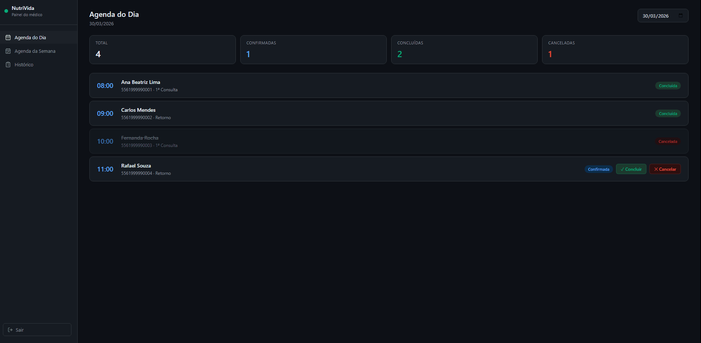

# 📲 WhatsApp Clinic Bot — Automação de Atendimento para Clínica de Nutrição

<div align="center">


**Bot de atendimento via WhatsApp que automatiza agendamentos, lembretes e notificações para clínicas de nutrição — sem intervenção humana. Inclui painel web para o médico gerenciar a agenda em tempo real.**

</div>

---

## 🖥️ Painel do Médico



Painel web construído em **React + Vite** com autenticação JWT. O médico visualiza e gerencia toda a agenda sem precisar acessar o WhatsApp.

---

## 🎯 O que esse sistema faz

O paciente envia uma mensagem. O bot responde com um menu interativo, coleta as informações necessárias, verifica os horários disponíveis no banco de dados, confirma o agendamento e notifica o médico — tudo automaticamente.

- **Agendamento completo via WhatsApp** — sem ligações, sem formulários
- **Controle de horários em tempo real** — bloqueia automaticamente slots ocupados
- **Lembretes automáticos** antes da consulta via APScheduler
- **Notificação ao médico** ao confirmar novo agendamento
- **Resumo diário da agenda** enviado ao médico às 06h
- **Log completo** de todas as mensagens enviadas pela API
- **Painel web** para o médico concluir, cancelar e visualizar consultas

---

## 🏗️ Arquitetura

```
wppclinica/
├── app.py                        # Webhook Flask — recebe e roteia mensagens
├── api.py                        # API REST — rotas do painel com autenticação JWT
├── config/
│   └── settings.py               # Variáveis de ambiente via .env
├── database/
│   ├── connection.py             # Conexão com MySQL (pool)
│   ├── clientes.py               # CRUD de pacientes
│   ├── consultas.py              # CRUD de agendamentos
│   ├── estados.py                # Persistência de estado de conversa
│   ├── mensagens.py              # Log de mensagens enviadas
│   └── init_db.py                # Criação das tabelas e seed inicial
├── services/
│   ├── bot.py                    # Lógica do fluxo de conversa
│   ├── whatsapp.py               # Integração com WhatsApp Cloud API
│   ├── scheduler.py              # Lembretes automáticos (APScheduler)
│   └── notificacoes_medico.py    # Notificações e resumo diário
├── utils/
│   └── helpers.py                # Helpers de data, horário e JSON
├── frontend/                     # Painel do médico (React + Vite)
│   └── src/
│       ├── pages/                # Login, AgendaDia, AgendaSemana, Historico
│       ├── components/           # Layout, ConsultaCard
│       └── api/                  # Integração com a API Flask (axios + JWT)
├── tests/
│   └── tests_bot.py              # Testes unitários
├── clinica.sql                   # Dump do banco de dados
├── .env.example
├── requirements.txt
└── README.md
```

---

## 💬 Fluxo de Conversa

```
[Usuário envia mensagem]
        │
        ▼
[Bot verifica estado atual no banco]
        │
        ├── INICIO / palavras-chave ──► Menu principal
        │                                     │
        │                         ┌───────────┴───────────┐
        │                    [1] Agendar             [2] Cancelar
        │                         │                       │
        │               Tipo de consulta          Cancela a última
        │                         │               consulta agendada
        │              ┌──────────┴──────────┐
        │         [1] Primeira          [2] Retorno
        │              │
        │              ▼
        │       Período (Manhã / Tarde)
        │              │
        │              ▼
        │       Data (DD/MM)
        │              │
        │              ▼
        │       Horários disponíveis
        │              │
        │              ▼
        │       Coleta nome e sexo
        │              │
        │              ▼
        │       Resumo para confirmação
        │              │
        └── Salva no banco ──► Confirmação + notificação ao médico
```

---

## ⚙️ Stack

| Tecnologia | Uso |
|---|---|
| Python 3.11+ | Linguagem principal |
| Flask | Backend / Webhook / API REST |
| MySQL | Banco de dados relacional |
| APScheduler | Lembretes e tarefas agendadas |
| WhatsApp Cloud API (Meta) | Envio e recebimento de mensagens |
| React + Vite | Painel web do médico |
| Axios + JWT | Autenticação e consumo da API |
| python-dotenv | Gerenciamento de variáveis de ambiente |
| ngrok | Exposição do webhook em desenvolvimento |

---

## 🚀 Como rodar

### Backend (Bot + API)

```bash
git clone https://github.com/joaoarchives/whatsapp-clinica-bot.git
cd whatsapp-clinica-bot
python -m venv venv
venv\Scripts\activate     # Windows
pip install -r requirements.txt
cp .env.example .env
python database/init_db.py
flask run
```

### Painel do Médico

```bash
cd frontend
npm install
npm run dev
```

Acesse em `http://localhost:5173`

---

## ✅ Funcionalidades

- [x] Menu automático de atendimento
- [x] Bloqueio automático de horários ocupados
- [x] Diferenciação entre primeira consulta e retorno
- [x] Cancelamento de consultas via WhatsApp
- [x] Notificação ao médico ao confirmar nova consulta
- [x] Resumo diário da agenda enviado ao médico às 06h
- [x] Log completo de mensagens enviadas
- [x] Painel web com autenticação JWT
- [x] Agenda do dia com cards de estatísticas
- [x] Agenda da semana com navegação
- [x] Histórico de consultas finalizadas
- [x] Concluir e cancelar consultas pelo painel
- [ ] Instruções pré-consulta automáticas após agendamento
- [ ] Integração com LLM para atendimento mais natural
- [ ] Lembretes configuráveis por tipo de consulta

---

## 👨‍💻 Autor

**João Victor Mendes Silveira**
Ciência da Computação — UDF, 5º semestre

[](https://github.com/joaoarchives)
[](https://www.linkedin.com/in/joão-victor-m-silveira-478542311)
